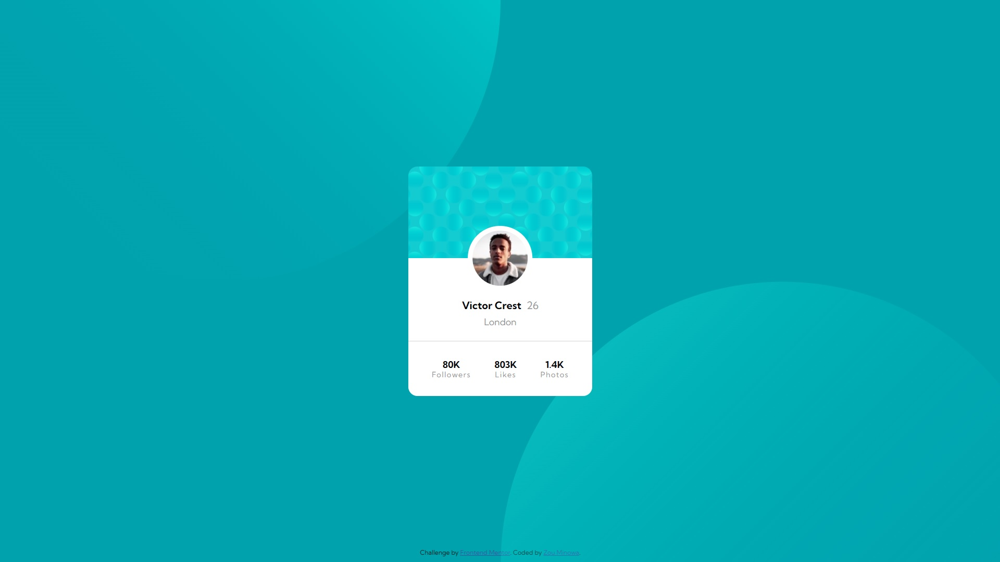

# Frontend Mentor - Profile card component solution

This is a solution to the [Profile card component challenge on Frontend Mentor](https://www.frontendmentor.io/challenges/profile-card-component-cfArpWshJ).

## Table of contents

- [Overview](#overview)
  - [The challenge](#the-challenge)
  - [Screenshot](#screenshot)
  - [Links](#links)
- [My process](#my-process)
  - [Built with](#built-with)
  - [What I learned](#what-i-learned)
  - [Continued development](#continued-development)
  - [Useful resources](#useful-resources)
- [Author](#author)

## Overview

### The challenge

- Build out the project to the designs provided

### Screenshot



### Links

- Solution URL: [https://github.com/Zomino/fm-profile-card-component](https://github.com/Zomino/fm-profile-card-component)
- Live Site URL: [https://zomino.github.io/fm-profile-card-component/](https://zomino.github.io/fm-profile-card-component/)

## My process

### Built with

- Semantic HTML5 markup
- CSS custom properties
- CSS psuedo-elements
- CSS keyframe animations
- Flexbox

### What I learned

- Flexbox can be used as a quick way to center elements vertically
- Psuedo-elements can be used to create custom backgrounds
- Avoid using empty divs just for styling purposes where possible

I was quite happy with the below CSS, which allowed me to easily position the card contents without extra divs or much attention to margin/padding. This version replaced my original attempt, which used an empty div just to hold the card background, and also had a lot of margin and padding properties on individual elements to stop the text from coming into contact with the image while remaining evenly spaced.

```css
.profile-container {
  position: absolute;
  top: 40%;
  left: 0;
  right: 0;
  bottom: 0;
  background-color: white;
  display: flex;
  flex-direction: column;
  justify-content: flex-end;
  text-align: center;
}
```

### Continued development

I would like to incorporate more CSS animations and psuedo-elements into my designs, as well as begin looking into vendor prefixes for CSS properties.

### Useful resources

- [EM vs REM vs PX – Why you shouldn't “just use pixels”](https://engageinteractive.co.uk/blog/em-vs-rem-vs-px) - This helped me to better understand how to use the different CSS units.
- [PX, EM or REM Media Queries?](https://zellwk.com/blog/media-query-units/) - This article explains why ems should be used for media queries.
- [Kevin Powell - Controlling background-images | CSS Tutorial](https://www.youtube.com/watch?v=3T_Jy1CqH9k&t=766s) - This helped me to understand working with multiple background images, especially with their positioning.

## Author

- Frontend Mentor - [@Zomino](https://www.frontendmentor.io/profile/Zomino)